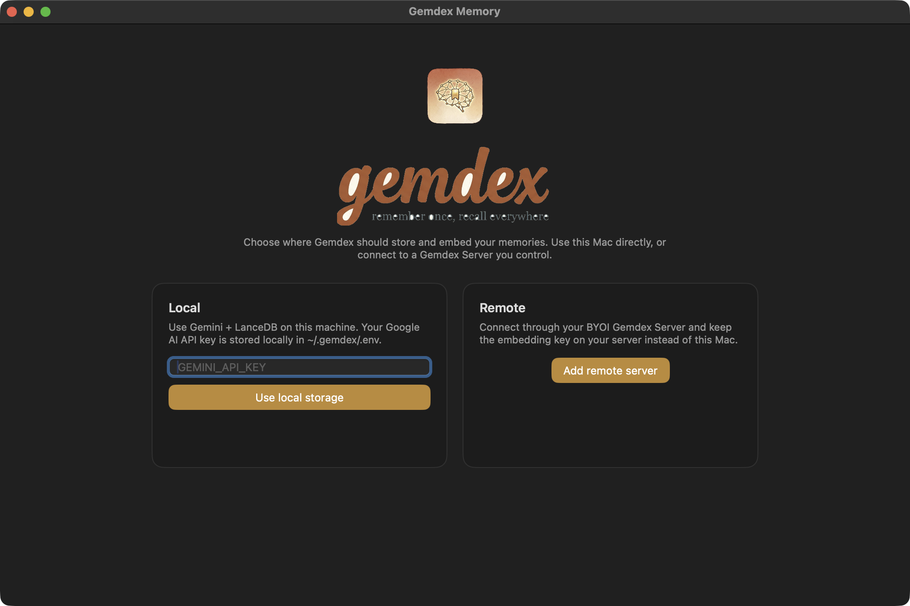
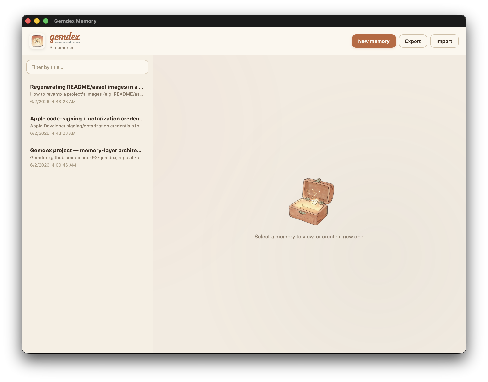

<div align="center">


### A global, persistent memory layer for AI coding agents — Gemini embeddings × LanceDB × MCP

[](https://www.npmjs.com/package/gemdex-mcp)
[](https://www.npmjs.com/package/gemdex-mcp)
[](https://github.com/anand-92/gemdex/stargazers)
[](LICENSE)
[](https://nodejs.org/)
[](https://modelcontextprotocol.io)
[](https://ai.google.dev/)
[](https://lancedb.com/)

**[⭐ Star on GitHub](https://github.com/anand-92/gemdex)** · **[📦 npm](https://www.npmjs.com/package/gemdex-mcp)** · **[💬 Discussions](https://github.com/anand-92/gemdex/discussions)** · **[🐛 Issues](https://github.com/anand-92/gemdex/issues)**

</div>

<p align="center">
  
</p>

## Why Gemdex

> Your agent re-learns everything every session. You explained your deploy flow
> last week; today it has no idea. Gemdex gives it **durable memory** you write
> on purpose — once, recallable everywhere.

A memory layer is a **deliberately written, persistent store** that is the
source of truth. You teach your agent something once, and it remembers forever,
across every repo and every session.

- 🧠 **You decide what to remember** — explicit `save_memory` / `recall` /
  `update_memory`. No silent capture, no background recall.
- 🌍 **One global pool** — every memory is searchable from everywhere. No
  scopes, no folders, no tags; embeddings do the disambiguation.
- 🔎 **Sharp recall, whole answers** — hybrid semantic + BM25 over internal
  chunks, but recall always returns the **full memory, never a fragment**.
- 🔌 **Plug-and-play** — speaks MCP over stdio, so any compatible client
  (Claude Code, Cursor, Codex CLI, Windsurf, Cline, Continue, Zed…) works
  instantly.
- 🪶 **Local by default** — use embedded LanceDB at `~/.gemdex`, or connect
  multiple machines to a Gemdex Server running in infrastructure you own.
- 🖥️ **Desktop manager** — a native app to browse / edit / delete / export /
  import your memory layer.

## The motivating workflows

```
During a session:
  "We just figured out how to wire up the Junie review workflow — save that to memory."

Weeks later, a different repo:
  "Set up the Junie review workflow here — check your memory layer for how we do it."

Different machine, different app:
  "Notarize and sign this build — the credentials and steps are in my memory layer."
```

## Quickstart (under a minute)

There's **no setup step** for the store — LanceDB is embedded and persists at
`~/.gemdex/lance` automatically the first time you save a memory.

### Wire Gemdex into your agent

**Claude Code (one-command plugin install — recommended):**

```bash
/plugin marketplace add anand-92/gemdex
/plugin install gemdex@gemdex
```

You'll be prompted for `GEMINI_API_KEY`. Sensitive values are stored in your OS
keychain. The plugin ships:

- the `gemdex` MCP server (no local checkout — runs via `npx -y gemdex-mcp@latest`), and
- a `memory` skill that nudges Claude to save / recall / update **only when you
  explicitly point at memory**.

See [`plugin/README.md`](plugin/README.md) for the full layout.

**Claude Code (manual, no plugin):**

```bash
claude mcp add gemdex \
  -e GEMINI_API_KEY=your-key \
  -- npx -y gemdex-mcp@latest
```

**Any other MCP client** (Cursor, Codex CLI, Windsurf, Cline, Continue, Zed…):

```json
{
  "mcpServers": {
    "gemdex": {
      "command": "npx",
      "args": ["-y", "gemdex-mcp@latest"],
      "env": {
        "GEMINI_API_KEY": "your-key"
      }
    }
  }
}
```

### Save and recall

```
Save how we set up the Junie review workflow to memory.
```

…later, in any repo on any machine:

```
Set up the Junie review workflow here — check your memory layer.
```

Done. Your agent now has a tiny, durable knowledge store it writes on purpose
and reads on command.

### Nudge your agent to actually use it (the single biggest thing you can do)

> Agents won't reach for a new MCP tool on their own. Tell your agent, at the
> top of every session, that it exists and when to use it.

**For Claude Code** — drop this into `CLAUDE.md` at the repo root (or
`~/.claude/CLAUDE.md` to apply globally):

```markdown
## Memory layer (Gemdex)

`gemdex` MCP exposes `save_memory`, `recall`, and `update_memory` — a global,
durable memory store shared across every repo and session. EXPLICIT ONLY:

- `save_memory(content, title?)` when the user says remember/save to memory.
- `recall(query, limit?)` when the user points at memory ("check your memory
  layer", "how do we usually do X", "where are the … credentials"). Returns
  full memories, never fragments.
- `update_memory(id, content, title?)` to revise a stored memory.

Never auto-capture a session and never recall unprompted. There's no delete
tool — deletion is a human action in the Gemdex desktop app. If these tools
aren't in your toolset, the MCP isn't connected.
```

**For Codex CLI, Cursor, Windsurf, Cline, Continue, Zed** — paste the same
snippet into your client's root instructions file (conventionally `AGENTS.md`).

> If you installed the Claude Code plugin, this nudge already ships as a bundled
> `memory` skill — you can skip `CLAUDE.md` and it'll still work.

## The 3 MCP tools

| Tool | Input | Returns | When the agent calls it |
|------|-------|---------|-------------------------|
| `save_memory` | `content` and/or `attachments`, `title` (optional) | new `id` + resolved title | only when told to remember/save |
| `recall` | `query` and/or `attachments` (at least one required), `limit` (optional, ~10) | full memories ranked by relevance | only when pointed at memory |
| `update_memory` | `id` (required); `content`, `title`, `attachments` (optional — at least one required) | updated `id` + title | to revise a stored memory |

Deletion is intentionally **not** an agent tool — it's a deliberate human action
in the desktop app. All three tools embed via Gemini. Local mode requires
`GEMINI_API_KEY`; remote mode uses the Gemdex Server owner's key.

### Multimodal attachments

`save_memory` and `update_memory` accept an optional `attachments` array of
inline media — `{ mimeType, data (base64), caption? }` — embedded into the same
space as text by `gemini-embedding-2`. Supported types and per-memory caps:
PNG/JPEG images (≤ 6), MP3/WAV audio (≤ 1), MP4/MOV video (≤ 1), and PDF (≤ 1).
Each attachment is embedded as
its own unit; its `caption` (or the memory title) backs the keyword branch. Raw
bytes are stored as blobs under `~/.gemdex/blobs` and round-trip through
export/import. Attachments require the `gemini-embedding-2` model — supplying
them to a text-only model returns a clear error.

`recall` works both ways: query by text, by media, or both. Each query
attachment is embedded into the shared space and runs its own similarity branch,
fused with the text branch via Reciprocal Rank Fusion — so you can recall a
memory from a screenshot, an audio clip, or a PDF as easily as from a phrase.

## How it works

<p align="center">
  
</p>

1. **Save** — `content` is split into retrieval **chunks**; each chunk is
   embedded with Gemini and stored with a `parent_id` pointing back to the whole
   memory.
2. **Recall** — hybrid search (dense vector + BM25, fused with Reciprocal Rank
   Fusion) ranks **chunks**, then each match resolves to its **full parent
   memory** and results are deduped by `parent_id`. So a query that matches one
   paragraph of a 300-line playbook gets the entire playbook back, in one shot.
3. **Store** — everything lives in a single global LanceDB table under
   `~/.gemdex`. The agent's MCP process and the desktop app's sidecar share the
   same store, so a memory saved by one shows up in the other.

This is the well-worn **parent-document retriever** ("small-to-big") pattern:
sharp matching on long content, but the agent always gets the whole memory.

## The desktop app

A native, **manage-only** app (built on [zero-native](https://www.npmjs.com/package/zero-native))
that opens straight into your memory layer:

- Browse / list all memories (sorted by recency).
- View, create, edit, and delete memories — including inline media attachments
  (drag-and-drop or pick image / audio / video / PDF, caption them, and preview
  them in place).
- "Find similar" on any attachment to recall related memories by media.
- Export all memories to a portable JSONL file; import them back.

There's **no free-text search box** — recall is an agent/MCP capability; the app
is a fast local manager (the only recall it surfaces is "Find similar", i.e.
recall-by-example from an existing attachment). On launch the app spawns its own Node sidecar
(`gemdex serve`) over localhost and opens directly into the manager. **You never
run a sidecar command.**

### First launch

If `GEMINI_API_KEY` is not configured yet, the app prompts once and stores it
locally in `~/.gemdex/.env`.

<p align="center">
  
</p>

### Memory manager

After setup, the app opens into the local manager for browsing, editing,
exporting, and importing memories.

<p align="center">
  
</p>

```bash
# from packages/app — requires Zig 0.16 and the zero-native CLI
cd packages/app
zig build run            # builds the frontend + native shell and opens the window
```

The sidecar is the same package as the MCP server:

```bash
npx gemdex serve --port 0   # localhost HTTP/JSON manager API; --port 0 = auto-pick
```

| Method + path | Purpose |
|---|---|
| `GET /health` | readiness probe |
| `GET /memories` | list (sorted by `updatedAt` desc) |
| `GET /memories/:id` | full memory |
| `POST /memories` | create (embeds via Gemini) |
| `PUT /memories/:id` | edit (re-chunk + re-embed) |
| `DELETE /memories/:id` | delete |
| `GET /export` · `POST /import` | portable backup / restore (upsert by id) |

The sidecar binds `127.0.0.1` only — it's a single-user local app.

## Self-hosted remote mode (BYOI)

Run Gemdex Server with Postgres/pgvector and file or S3-compatible attachment
storage, then connect MCP, CLI, and desktop clients to the same global memory
pool. Embedding runs on the server, so remote clients do not need a Gemini key.

It's two commands. On the server host:

```bash
git clone https://github.com/anand-92/gemdex.git
cd gemdex/packages/server && npm run init   # generates secrets, starts Docker, prints the token
```

On each client (paste the token when prompted; add `--import-local` to bring
your existing local memories along):

```bash
npx -y gemdex-mcp@latest init-remote myserver https://memory.example.com
```

`init-remote` verifies the server, switches the client to remote mode, and
prints the agent command. You can also run a **local and a remote pool side by
side** — see the operations guide.

Start with the [`BYOI operations guide`](docs/BYOI_OPERATIONS.md). The
[`remote mode contract`](docs/BYOI_REMOTE_MODE.md) defines the v1 API, auth,
attachment handling, compatibility checks, ranking invariants, and non-goals.

## Use as a library

Skip the MCP server and embed the memory store directly:

```ts
import { MemoryStore, LanceDBVectorDatabase, GeminiEmbedding } from 'gemdex-core';

const embedding = new GeminiEmbedding({
  apiKey: process.env.GEMINI_API_KEY!,
  model: 'gemini-embedding-2',
});

// Pass nothing to use the default ~/.gemdex/lance directory.
const vectorDatabase = new LanceDBVectorDatabase();
const memory = new MemoryStore({ embedding, vectorDatabase });

const { id } = await memory.save({
  content: 'Notarize with: xcrun notarytool submit …',
  title: 'macOS notarization',
});

const hits = await memory.recall('how do we notarize builds', 5);
console.log(hits[0].content); // the full memory, never a fragment
```

## Packages

| Package | Description |
|---------|-------------|
| [`gemdex-core`](packages/core) | Memory store (parent-document chunking), Gemini embedding client, embedded LanceDB hybrid retrieval |
| [`gemdex-mcp`](packages/mcp) | MCP server (`save_memory`/`recall`/`update_memory`) + `gemdex serve` localhost sidecar |
| [`gemdex-server`](packages/server) | Self-hosted BYOI HTTP backend using Postgres/pgvector and file or S3-compatible blobs |
| [`packages/app`](packages/app) | zero-native desktop app to manage the memory layer |

## Configuration

<details>
<summary>All environment variables</summary>

| Variable | Required | Default | Description |
|----------|----------|---------|-------------|
| `GEMINI_API_KEY` | yes | — | Google AI Studio API key (needed to embed on save/recall/update) |
| `LANCEDB_PATH` | no | `~/.gemdex/lance` | Filesystem path for the embedded memory store |
| `EMBEDDING_MODEL` | no | `gemini-embedding-2` | Override Gemini embedding model |
| `EMBEDDING_DIMENSION` | no | model default | Force Matryoshka-resized dimension (256/768/1536/3072) |
| `GEMINI_BASE_URL` | no | Google default | Custom Gemini endpoint |
| `HYBRID_MODE` | no | `true` | Disable to use dense-only recall |
| `GEMDEX_SERVE_PORT` | no | auto (0) | Default port for `gemdex serve` (the app picks one automatically) |
| `GEMDEX_MODE` | no | `local` | Select the embedded `local` backend or a configured `remote` backend |
| `GEMDEX_REMOTE_URL` | remote only | — | Gemdex Server root URL |
| `GEMDEX_REMOTE_TOKEN` | remote only | — | Gemdex Server bearer token |

</details>

## Privacy & safety

Gemdex is a **power-dev tool with zero guardrails by design**. You may store API
keys, credentials, and account details in plaintext. There is no secret
redaction, encryption mandate, or safety enforcement. In local mode, records
stay on the client except content sent to Gemini for embedding. In BYOI mode,
records live in your server/database/blob infrastructure and embedding payloads
are sent from that server to Gemini. Gemdex provides no hosted custody or
account service. See the [BYOI security model](docs/BYOI_OPERATIONS.md#security-and-custody).

## Build from source

```bash
git clone https://github.com/anand-92/gemdex.git
cd gemdex
pnpm install
pnpm build
```

The MCP entry point lands at `packages/mcp/dist/index.js`. Point your MCP client
at `node /absolute/path/to/packages/mcp/dist/index.js` to run a local build.

## Roadmap

- [ ] Optional encryption-at-rest for sensitive memories
- [ ] Packaged desktop app binaries (macOS / Linux / Windows)
- [ ] Multi-machine sync service (beyond export/import)
- [ ] Memory linking / references
- [ ] CLI (`gemdex recall "..."`) for non-MCP workflows

Have an idea? [Open a discussion](https://github.com/anand-92/gemdex/discussions/new).

## Contributing

First time contributors very welcome. See [CONTRIBUTING.md](CONTRIBUTING.md) for
the dev loop, then check the `good-first-issue` label.

## Star history

[](https://star-history.com/#anand-92/gemdex&Date)

---

<p align="center">
  
</p>

<div align="center">

If Gemdex makes your agent remember, **[give it a ⭐](https://github.com/anand-92/gemdex)** — it's the single biggest thing that helps the project grow.

</div>

## License

MIT. See [LICENSE](LICENSE).
