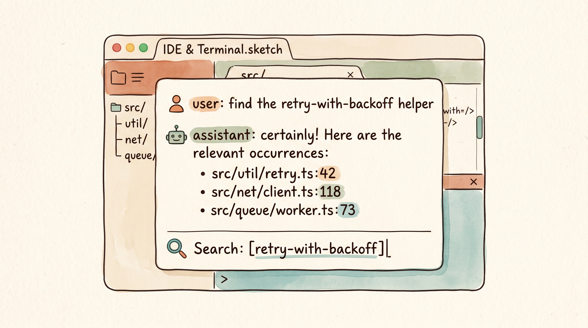
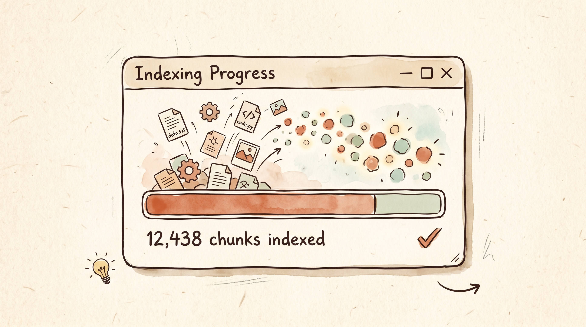
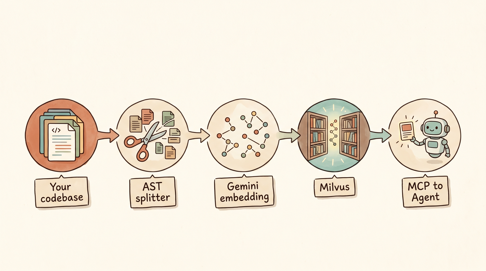

<div align="center">


### Semantic code search for AI coding agents — Gemini embeddings × Milvus × MCP

[](https://www.npmjs.com/package/gemdex-mcp)
[](https://www.npmjs.com/package/gemdex-mcp)
[](https://github.com/anand-92/gemdex/stargazers)
[](LICENSE)
[](https://nodejs.org/)
[](https://modelcontextprotocol.io)
[](https://ai.google.dev/)
[](https://milvus.io/)

**[⭐ Star on GitHub](https://github.com/anand-92/gemdex)** · **[📦 npm](https://www.npmjs.com/package/gemdex-mcp)** · **[💬 Discussions](https://github.com/anand-92/gemdex/discussions)** · **[🐛 Issues](https://github.com/anand-92/gemdex/issues)**

</div>

<p align="center">
  
</p>

## Why Gemdex

> Loading a whole repo into an LLM's context every turn is slow, expensive, and forgetful.
> Gemdex finds the **right** code first, then hands only those chunks to your agent.

- 🧠 **Semantically smart** — AST-aware chunks embedded with Gemini Embedding 2 (8K context, 3072 dim, Matryoshka-resizable).
- 💸 **Token-cheap** — agents query natural language, get back targeted file:line hits instead of dragging in whole files.
- 🔌 **Plug-and-play** — speaks MCP over stdio, so any compatible client (Claude Code, Cursor, Codex CLI, Windsurf, Cline, Continue, Zed…) can use it instantly.
- 🌐 **Local-first** — runs against your own Milvus (Docker) — no SaaS, no telemetry, no third-party hops.
- ♻️ **Always fresh** — incremental Merkle-tree change detection + an optional file-trigger watcher keep the index in sync as you code.

## See it in action

<p align="center">
  
</p>

Ask your agent:

```
Find the retry-with-backoff helper.
```

…and instead of grep-spraying or stuffing your repo into the prompt, Gemdex hands back the three files that actually implement it.

## Quickstart (under a minute)

### 1. Get Milvus running (local Docker)

```yaml
# ~/milvus/docker-compose.yml
services:
  milvus:
    container_name: milvus-standalone
    image: milvusdb/milvus:v2.5.10
    environment:
      ETCD_USE_EMBED: "true"
      ETCD_DATA_DIR: /var/lib/milvus/etcd
      ETCD_CONFIG_PATH: /milvus/configs/embedEtcd.yaml
      COMMON_STORAGETYPE: local
      DEPLOY_MODE: STANDALONE
    volumes:
      - ./volumes/milvus:/var/lib/milvus
      - ./embedEtcd.yaml:/milvus/configs/embedEtcd.yaml
      - ./user.yaml:/milvus/configs/user.yaml
    ports:
      - "19530:19530"
      - "9091:9091"
      - "2379:2379"
    command: ["milvus", "run", "standalone"]
```

```bash
cd ~/milvus && docker compose up -d
```

### 2. Wire Gemdex into your agent

**Claude Code (one-command plugin install — recommended):**

```bash
/plugin marketplace add anand-92/gemdex
/plugin install gemdex@gemdex
```

You'll be prompted for `GEMINI_API_KEY` and `MILVUS_ADDRESS` (default `localhost:19530`). Sensitive values are stored in your OS keychain. The plugin ships:

- the `gemdex` MCP server (no local checkout — runs via `npx -y gemdex-mcp@latest`),
- a `code-search` skill that nudges Claude to prefer `search_code` over `Grep`/`Glob` for semantic queries, and
- a `PostToolUse` hook that auto-reindexes after every `Edit`/`Write`/`MultiEdit`.

See [`plugin/README.md`](plugin/README.md) for the full layout.

**Claude Code (manual, no plugin):**

```bash
claude mcp add gemdex \
  -e GEMINI_API_KEY=your-key \
  -e MILVUS_ADDRESS=localhost:19530 \
  -- npx -y gemdex-mcp@latest
```

**Any other MCP client** (Cursor, Codex CLI, Windsurf, Cline, Continue, Zed…):

```json
{
  "mcpServers": {
    "gemdex": {
      "command": "npx",
      "args": ["-y", "gemdex-mcp@latest"],
      "env": {
        "GEMINI_API_KEY": "your-key",
        "MILVUS_ADDRESS": "localhost:19530"
      }
    }
  }
}
```

### 3. Index, then ask

```
Index this codebase.
```

<p align="center">
  
</p>

```
Search for the websocket reconnection logic.
```

Done. The agent now has a tiny, accurate retrieval layer between itself and your code.

### 4. Nudge your agent to actually use it

Agents won't always reach for a new tool on their own. Drop the excerpt below into your top-level `AGENTS.md` (Codex CLI, Cursor, Windsurf, etc.) and/or `CLAUDE.md` so every session starts with the right instinct:

```markdown
## Code search

This repo is indexed by **Gemdex** (MCP server `gemdex`). Before grepping, reading large
files, or guessing at where something lives, call the `search_code` MCP tool with a
natural-language query (e.g. "websocket reconnection logic", "JWT refresh handler").
Use `index_codebase` once per fresh checkout and `get_indexing_status` if results
look stale. Prefer Gemdex over `rg`/`grep` for semantic questions; fall back to
`rg` only for exact-string lookups.
```

## How it works

<p align="center">
  
</p>

1. **Your codebase** — pointed at any local directory.
2. **AST splitter** — tree-sitter parses each file and emits semantically-coherent chunks (functions, classes, blocks), falling back to language-agnostic splitting when needed.
3. **Gemini embedding** — chunks become 3072-dim vectors (Matryoshka-resizable to 1536/768/256 if you want smaller, cheaper indexes).
4. **Milvus** — vectors land in a collection with hybrid dense + BM25 retrieval enabled by default.
5. **MCP → Agent** — your agent calls `search_code` with a natural-language query and receives ranked file:line snippets.

## Features

| | |
|---|---|
| 🌳 **AST-aware chunking** | tree-sitter grammars for TypeScript, JavaScript, Python, Java, C/C++, C#, Go, Rust, PHP, Ruby, Swift, Kotlin, Scala, Markdown |
| 🧬 **Hybrid retrieval** | dense vector + BM25 fusion by default; switch to dense-only with one env var |
| 📐 **Matryoshka dimensions** | drop embedding size to 1536 / 768 / 256 for smaller indexes and faster queries |
| ♻️ **Incremental sync** | Merkle-tree change detection re-embeds only what moved |
| ⚡ **Trigger watcher** | `touch ~/.gemdex/.sync-trigger` forces an immediate re-sync — perfect for editor hooks |
| 🏠 **Local-only** | self-hosted Milvus; no SaaS dependency, no telemetry |
| 🧰 **4 MCP tools** | `index_codebase`, `search_code`, `clear_index`, `get_indexing_status` |
| 🔧 **Configurable** | custom extensions, custom ignore patterns, custom embedding model, custom Gemini base URL |

## Auto-reindex on every edit (Claude Code)

Drop this into `~/.claude/settings.json` and the index stays fresh as you save files:

```json
{
  "hooks": {
    "PostToolUse": [
      { "matcher": "Edit|Write|MultiEdit",
        "hooks": [{ "type": "command", "command": "touch ~/.gemdex/.sync-trigger" }] }
    ]
  }
}
```

Equivalent hooks work in Cursor, Codex CLI, and any client that can run a shell command on save.

## Where Gemdex fits

|                                  | grep / ripgrep | Plain RAG over full files | Cloud code-search SaaS | **Gemdex** |
|----------------------------------|:--------------:|:-------------------------:|:----------------------:|:----------:|
| Understands intent, not just strings | ❌ | ✅ | ✅ | ✅ |
| AST-coherent chunks (no half-functions) | ❌ | ❌ | varies | ✅ |
| Hybrid dense + lexical (BM25) | ❌ | rare | ✅ | ✅ |
| Runs 100% locally / self-hosted | ✅ | varies | ❌ | ✅ |
| Designed for AI agents via MCP | ❌ | ❌ | ❌ | ✅ |
| Incremental, on-edit re-index | ❌ | ❌ | ✅ | ✅ |
| Open source, MIT | ✅ | varies | ❌ | ✅ |

## Use as a library

Skip the MCP server and embed Gemdex directly in your own tooling:

```ts
import { Context, MilvusVectorDatabase, GeminiEmbedding } from 'gemdex-core';

const embedding = new GeminiEmbedding({
  apiKey: process.env.GEMINI_API_KEY!,
  model: 'gemini-embedding-2',
});

const vectorDatabase = new MilvusVectorDatabase({
  address: 'localhost:19530',
});

const context = new Context({ embedding, vectorDatabase });

await context.indexCodebase('./my-project');
const results = await context.semanticSearch('./my-project', 'how does auth work', 5);
```

## Packages

| Package | Description |
|---------|-------------|
| [`gemdex-core`](packages/core) | Indexing engine, AST splitters, Gemini embedding client, Milvus vector store |
| [`gemdex-mcp`](packages/mcp) | MCP server binary that wires the core into an MCP stdio process |

## Configuration

<details>
<summary>All environment variables</summary>

| Variable | Required | Default | Description |
|----------|----------|---------|-------------|
| `GEMINI_API_KEY` | yes | — | Google AI Studio API key |
| `MILVUS_ADDRESS` | yes | `localhost:19530` | `host:port` of your Milvus instance |
| `MILVUS_TOKEN` | no | — | Auth token for Milvus instances with authentication enabled |
| `EMBEDDING_MODEL` | no | `gemini-embedding-2` | Override Gemini embedding model |
| `EMBEDDING_DIMENSION` | no | model default | Force Matryoshka-resized dimension (256/768/1536/3072) |
| `EMBEDDING_BATCH_SIZE` | no | 100 | Texts per embed request |
| `GEMINI_BASE_URL` | no | Google default | Custom Gemini endpoint |
| `HYBRID_MODE` | no | `true` | Disable to use dense-only vector search |
| `INDEX_MULTIMODAL` | no | `false` | Opt in to PDF and image indexing (`.pdf`, `.png`, `.jpg`, `.jpeg`, `.webp`, `.gif`) with `gemini-embedding-2` |
| `CUSTOM_EXTENSIONS` | no | — | Comma-separated extra file extensions (`.vue,.svelte`) |
| `CUSTOM_IGNORE_PATTERNS` | no | — | Comma-separated extra ignore globs |
| `CODE_CHUNKS_COLLECTION_NAME_OVERRIDE` | no | — | Readable prefix for Milvus collection names |
| `GEMDEX_BACKGROUND_SYNC` | no | `true` | Periodic background re-index |
| `GEMDEX_SYNC_INTERVAL_MS` | no | `300000` | Background sync period |
| `GEMDEX_TRIGGER_WATCHER` | no | `true` | Watch `~/.gemdex/.sync-trigger` for forced syncs |

</details>

## Build from source

```bash
git clone https://github.com/anand-92/gemdex.git
cd gemdex
pnpm install
pnpm build
```

The MCP entry point lands at `packages/mcp/dist/index.js`. Point your MCP client at `node /absolute/path/to/packages/mcp/dist/index.js` to run a local build.

## Roadmap

- [ ] pgvector backend (alongside Milvus)
- [ ] Additional grammars (Vue, Svelte, Zig, Lua, Solidity)
- [ ] First-class watch mode (no `touch` trigger required)
- [ ] Per-language re-rankers
- [ ] CLI (`gemdex search "..."`) for non-MCP workflows
- [ ] Web UI for browsing indexed projects

Have an idea? [Open a discussion](https://github.com/anand-92/gemdex/discussions/new) — early contributors get prioritized.

## Contributing

First time contributors very welcome. See [CONTRIBUTING.md](CONTRIBUTING.md) for the dev loop, then check the `good-first-issue` label.

## Star history

[](https://star-history.com/#anand-92/gemdex&Date)

---

<p align="center">
  
</p>

<div align="center">

If Gemdex makes your agent smarter or your bill smaller, **[give it a ⭐](https://github.com/anand-92/gemdex)** — it's the single biggest thing that helps the project grow.

</div>

## License

MIT. See [LICENSE](LICENSE).
